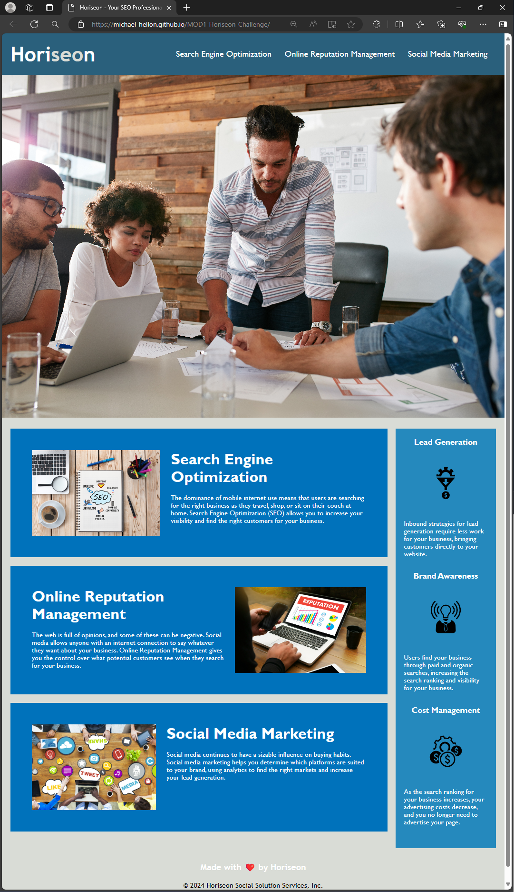

# MOD1-Challenge

## Description

For this project I was given code for a Webpage with a lot of bugs. My task was to refractor the code to clean it up without changing its functionality.

- My main goal and purpose was to clean up the semantic HTML elements, at the start there were a lot of < div > elements. The CSS styl;e sheet needs some fine tuning also.
- I did this project to test my knowledge of HTML/CSS and to build in more functionality to the page.
- This project fixes the accessibility standards and the semantic HTML elements so that it is optimized for search engines
- What did I learn?

## Table of Contents (Optional)

If your README is long, add a table of contents to make it easy for users to find what they need.

- [Installation](#installation)
- [Usage](#usage)
- [Credits](#credits)
- [License](#license)

## Installation

We are fixing a websote, so there are no special steps to install this project.

    What are the steps required to install your project? Provide a step-by-step description of how to get the development environment running.

## Usage

Provide instructions and examples for use. Include screenshots as needed.

To add a screenshot, create an `assets/images` folder in your repository and upload your screenshot to it. Then, using the relative filepath, add it to your README using the following syntax:

    ```md
    
    ```

## Credits

The following people contributed to this project.

    List your collaborators, if any, with links to their GitHub profiles.

    If you used any third-party assets that require attribution, list the creators with links to their primary web presence in this section.

    If you followed tutorials, include links to those here as well.

## License

Please refer to the LICENSE in the repo.

This file ends with a newline. [EOF]